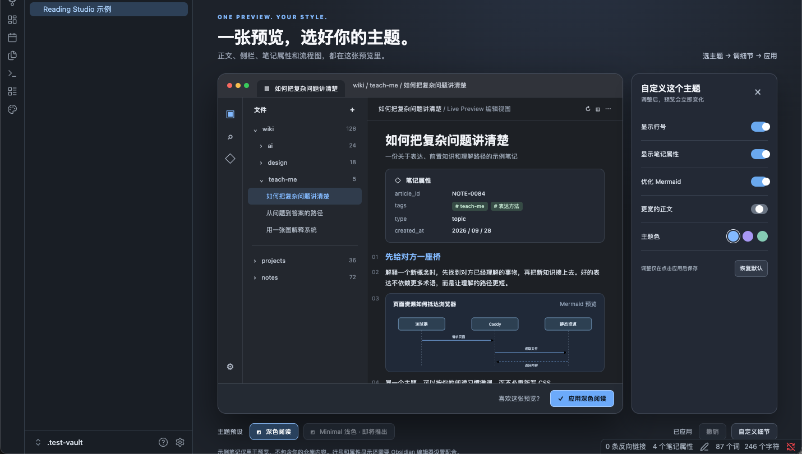

# Reading Studio

[简体中文](README_CN.md)

Reading Studio is a dark reading theme for desktop Obsidian with a companion visual-controls plugin. A single Obsidian-like preview shows the sidebar, note body, properties, line numbers, and Mermaid. Adjust the options as a draft, then click **Apply Dark Reading** (the current UI is in Chinese) to use them in your vault. **Undo** restores the previous applied configuration.



V1 includes one dark preset. The Minimal light option in the interface is a future concept and is disabled. Preview content is fictional; the plugin does not read or upload your notes and has no runtime network dependency.

## Install

Download the matching theme and plugin ZIP files from [Releases](https://github.com/wangjs-jacky/obsidian-reading-studio/releases). Unzip them into your vault:

```text
YOUR_VAULT/.obsidian/themes/Reading Studio/{manifest.json,theme.css}
YOUR_VAULT/.obsidian/plugins/reading-studio-controls/{manifest.json,main.js,styles.css}
```

In Obsidian, select **Reading Studio** under **Settings → Appearance → Themes**, choose **Dark** as the base color scheme, enable **Show line numbers** and set **Properties in document** to **Visible** under **Settings → Editor**, then enable **Reading Studio Controls** under **Community plugins**. Open it from the palette ribbon icon or the command palette. Obsidian may ask you to trust the vault when enabling community plugins for the first time.

Option changes affect only the preview until Apply. Settings persist across restarts; Undo restores the previous state. Reset restores the default draft without touching the applied appearance. The line-number and property switches only change visibility: they cannot generate line numbers or reveal native properties that Obsidian has disabled. The plugin checks these prerequisites and reports the required setting. It never changes Markdown, YAML, other themes, or Obsidian core configuration.

## Develop and verify

```bash
npm ci
npm test
npx tsc --noEmit
npm run build
npm run package:release
```

`npm run package:release` creates two installable ZIP files in `dist/`. The static demo in `demo/` uses the same UI and preset controller as the native plugin. `tests/e2e.ego.mjs` is an Ego Browser interaction test for draft changes, Apply, reload persistence, Undo, and prerequisite failure. `node scripts/install-test-vault.mjs` creates an isolated native Obsidian test vault. V1 was smoke-tested in Obsidian 1.13.7 on macOS, including the real theme, plugin, properties, line numbers, and Mermaid.

To rerun the interaction test, start `python3 -m http.server 4187` in the project root, then run `ego-browser nodejs < tests/e2e.ego.mjs` in another terminal. The demo URL is `http://127.0.0.1:4187/demo/`. The browser test covers shared interaction code; native rendering is checked separately in the isolated vault.

The [HTML interaction draft](design/prototype.html), [product design](docs/superpowers/specs/2026-09-28-obsidian-reading-studio-design.md), and [implementation plan](docs/superpowers/plans/2026-09-28-reading-studio-v1.md) are preserved in this repository. `design/preview.png` shows only the isolated test vault.

Desktop Obsidian 1.8.0 or newer is required. Mobile support and submission to Obsidian's community directories are not part of V1. The theme CSS was written for this project and does not contain Cupertino source code.

## License

MIT. See [LICENSE](LICENSE).
