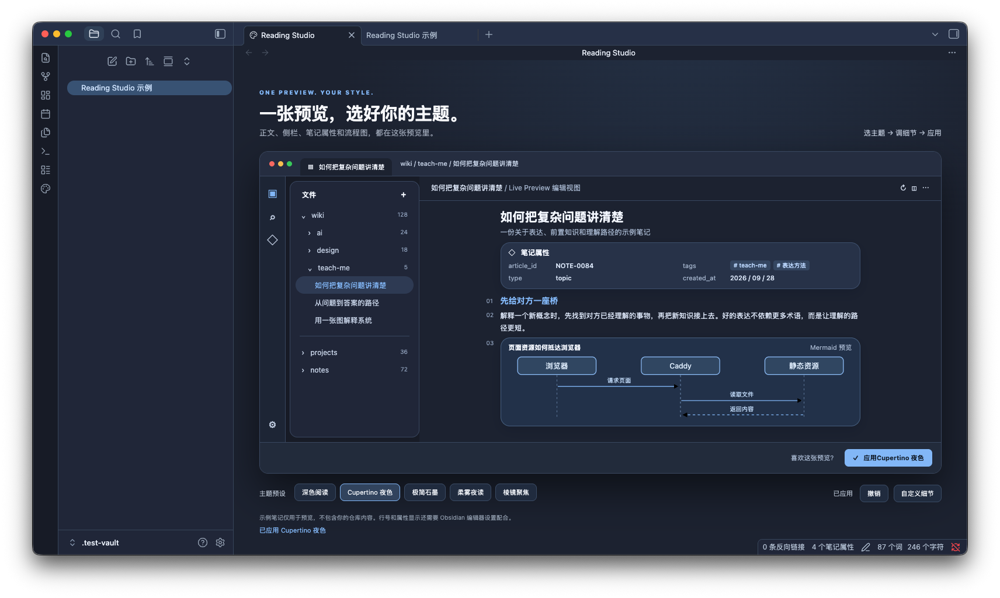

# Reading Studio

[简体中文](README_CN.md)

Reading Studio is a dark reading theme for desktop Obsidian with a companion visual-controls plugin. A single Obsidian-like preview shows the sidebar, note body, properties, line numbers, and Mermaid. Select a style pack and adjust its options as a draft, then click **Apply** (the UI is in Chinese) to use it in your vault. **Undo** restores the previous applied configuration.



[Compare all five native previews](design/packs/): [Deep Reading](design/packs/deep-reading.png) · [Cupertino Night](design/packs/cupertino-night.png) · [Minimal Graphite](design/packs/minimal-graphite.png) · [Soft Mist](design/packs/soft-mist.png) · [Prism Focus](design/packs/prism-focus.png). [See Prism Focus in a real note](design/preview-v2-prism.png).

Version 0.2.1 polishes five dark packs: Deep Reading, Cupertino Night, Minimal Graphite, Soft Mist, and Prism Focus. Their sidebar, body, properties, Mermaid, and control colors stay distinct. The preview now shows the whole diagram at standard desktop sizes, with larger note text and colors closer to the applied theme. Line numbers, property visibility, Mermaid styling, width, and accent remain independent controls. Light packs are not yet available. Preview content is fictional; the plugin does not read or upload your notes and has no runtime network dependency. Existing V1 Deep Reading settings continue to work.

## Install

On macOS, paste this command into Terminal. You do **not** need to find or type your vault path:

```bash
curl -fsSL https://raw.githubusercontent.com/wangjs-jacky/obsidian-reading-studio/main/scripts/install.sh | bash
```

An Obsidian vault is an ordinary local notes folder; **Git and GitHub are not required**. The installer reads Obsidian's registered vault paths and checks that the chosen folder contains `.obsidian`. It selects the sole valid vault, or the sole vault marked open while Obsidian is running. If several candidates remain, choose one by number; only if none is registered does it open a folder picker.

The installer downloads and verifies the v0.2.1 theme and plugin, backs up existing settings, and enables the theme, plugin, dark mode, line numbers, and visible properties. It disables only the old `cupertino-reading` and `cupertino-mermaid` snippets, preserving other snippets, settings, and saved plugin styles. **Restart Obsidian after installation.** Obsidian may still ask you to trust the vault when enabling community plugins for the first time. The backup location is printed in Terminal.

The same command also auto-detects the vault in an interactive SSH terminal. To target a different vault explicitly, pass its path:

```bash
curl -fsSL https://raw.githubusercontent.com/wangjs-jacky/obsidian-reading-studio/main/scripts/install.sh | bash -s -- "/path/to/your/vault"
```

Alternatively, download the matching theme and plugin ZIP files from [Releases](https://github.com/wangjs-jacky/obsidian-reading-studio/releases). Unzip them into your vault:

```text
YOUR_VAULT/.obsidian/themes/Reading Studio/{manifest.json,theme.css}
YOUR_VAULT/.obsidian/plugins/reading-studio-controls/{manifest.json,main.js,styles.css}
```

For manual installation, select **Reading Studio** under **Settings → Appearance → Themes**, choose **Dark** as the base color scheme, enable **Show line numbers** and set **Properties in document** to **Visible** under **Settings → Editor**, then enable **Reading Studio Controls** under **Community plugins**. Open it from the palette ribbon icon or the command palette.

Option changes affect only the preview until Apply. Settings persist across restarts; Undo restores the previous pack and options. Reset restores the current pack's default draft without touching the applied appearance. The line-number and property switches only change visibility: they cannot generate line numbers or reveal native properties that Obsidian has disabled. The plugin checks these prerequisites and reports the required setting. It never changes Markdown, YAML, other themes, or Obsidian core configuration.

## Develop and verify

```bash
npm ci
npm test
npx tsc --noEmit
npm run build
npm run package:release
```

`npm run package:release` creates two installable ZIP files in `dist/`. The static demo in `demo/` uses the same UI and preset controller as the native plugin. `tests/e2e.ego.mjs` checks all five previews, complete Mermaid framing, draft changes, Apply, reload persistence, cross-pack Undo, and prerequisite failure. `node scripts/install-test-vault.mjs` creates an isolated native Obsidian test vault. Version 0.2.1 was checked in Obsidian 1.13.7 on macOS, including real pack switching, properties, line numbers, and Mermaid.

To rerun the interaction test, start `python3 -m http.server 4187` in the project root, then run `ego-browser nodejs < tests/e2e.ego.mjs` in another terminal. The demo URL is `http://127.0.0.1:4187/demo/`. The browser test covers shared interaction code; native rendering is checked separately in the isolated vault.

The [HTML interaction draft](design/prototype.html), [V1 product design](docs/superpowers/specs/2026-09-28-obsidian-reading-studio-design.md), [V2 pack design](docs/superpowers/specs/2026-09-28-theme-packs-v2-design.md), and [inspiration and extension guide](docs/theme-inspiration.md) are preserved. The five images in `design/packs/` show the polished styles applied in an isolated Obsidian vault; `design/preview-v2.png` and `design/preview.png` remain as earlier references.

Desktop Obsidian 1.8.0 or newer is required. The one-command installer was also checked on a MacBook Air running macOS 14.1.1 with 17 existing community plugins: installation, backups, and repeat runs passed, and installed files and settings were verified. Its appearance after restarting Obsidian on that Air still needs visual confirmation. Mobile support and submission to Obsidian's community directories have not been verified. The theme CSS was written for this project and does not contain source code from the inspiration projects.

## License

MIT. See [LICENSE](LICENSE).
